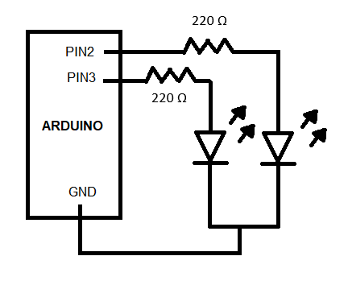
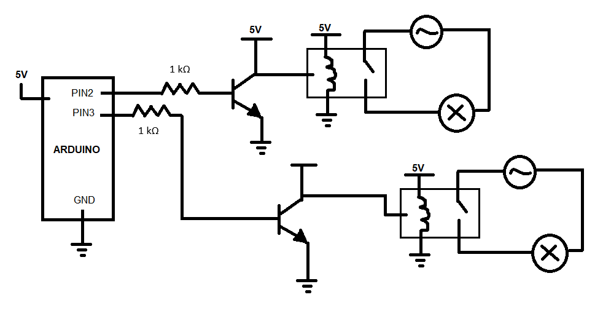

# SocketDuino
## Installation
In a console write the command below:
~~~
npm install
~~~
## Running
* Connect an Arduino board and burn it with the code inside the ArduinoCode folder
* Implement the circuit (from the circuits section) that you want to test 
* In **src/app.js** replaces the **"COM3"** with the serial port name where the Arduino board is connected
* To run in production mode, type the following command in a console:
    ~~~
    npm start
    ~~~
* To run in development mode, type the following command in a console:
    ~~~
    npm run dev
    ~~~
* Then, open a new browser tap with the URL **localhost:3000**
## Circuits
If you want to test the SocketDuino App with a led circuit, implement the following circuit diagram:

If you want a more realistic device, you can implement the following circuit diagram. This circuit is used to control the on/off of 120V lamps:

